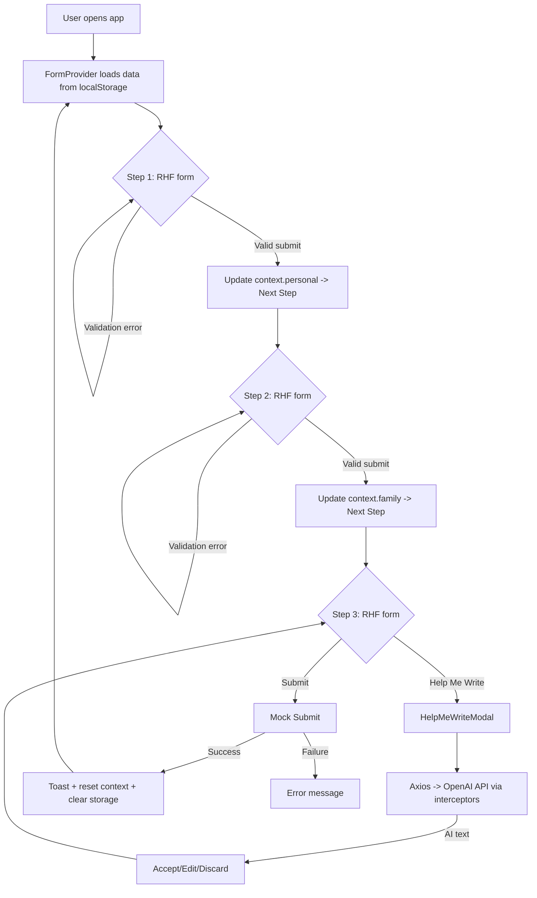

# Social Support Application – Frontend (React + Vite + TypeScript)

A responsive, accessible multi-step form wizard to help citizens apply for financial assistance. Includes a progress bar, English/Arabic with RTL support, local save, and AI-assisted writing for situation descriptions.

## Getting Started

1. Install dependencies:
   ```bash
   npm install
   ```
2. Create a `.env` file in the project root:
   ```bash
   echo "VITE_OPENAI_API_KEY=YOUR_OPENAI_KEY" > .env
   ```
   - If you don’t have a key or cannot call external APIs, the app still works; only the “Help Me Write” feature will show a missing key error.
3. Run the app:
   ```bash
   npm run dev
   ```

## Features
- Multi-step wizard with progress bar (3 steps).
- Responsive layout; keyboard accessible labels/inputs; ARIA roles on modal.
- English and Arabic support with RTL toggle.
- Local persistence to `localStorage`; reset clears progress.
- “Help Me Write” uses OpenAI Chat Completions to suggest text; user can Accept, Edit, or Discard in a modal.
- Mock submit simulates a network call and shows success/failure.
- React Hook Form handles validation and submission per step.
- Axios client with interceptors (auth header injection for OpenAI, error normalization).

## Structure
- `src/context/FormContext.tsx`: App state, step navigation, locale, and localStorage persistence.
- `src/components/Wizard.tsx`: Main wizard and steps; progress and navigation.
- `src/components/HelpMeWriteModal.tsx`: AI suggestion modal.
- `src/services/openai.ts`: Minimal client for OpenAI chat completions.
- `src/services/mockApi.ts`: Simulated submit.
- `src/i18n.ts`: Simple i18n dictionary.
- `src/types.ts`, `src/utils/storage.ts`: Types and storage helpers.

## OpenAI Details
- Endpoint: `https://api.openai.com/v1/chat/completions`
- Model: `gpt-3.5-turbo`
- Env var: `VITE_OPENAI_API_KEY`

## Notes
- No external UI or i18n libraries are required for this assignment. If desired, you can integrate MUI/Tailwind or react-i18next later without changing the core flow.

## Flow Diagram
The following Mermaid diagram summarizes the core interactions:


